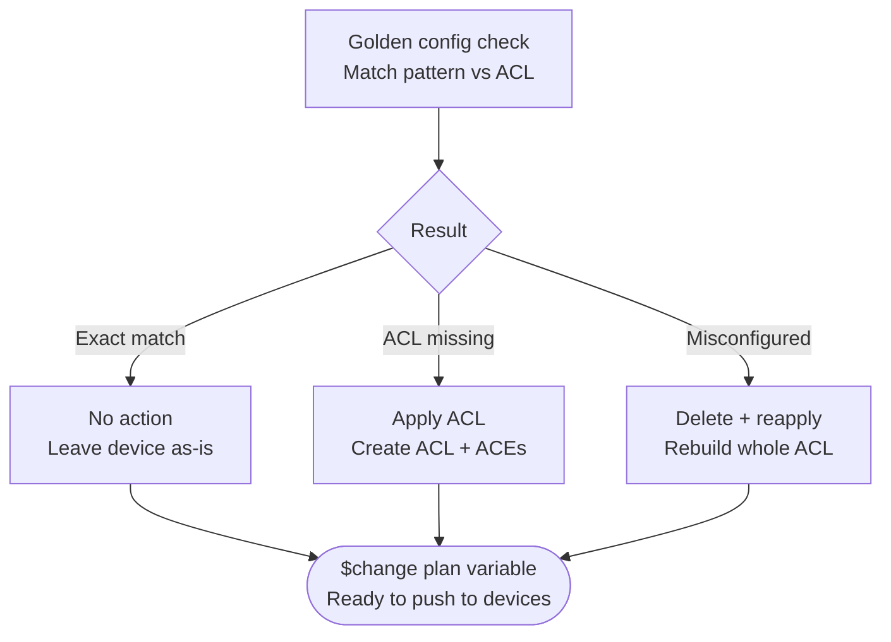

# 🕸️ Network Automation Toolkit


---

## 🗝️ About this repo

I'm a network and IT infrastructure engineer. I've spent years building automation for large global companies: data centers, campus networks, WAN, security infrastructure, pretty much all of it. This repo is where I collect the automations I've actually built and used on real networks. Not toy examples or demos, just stuff that replaced manual work, cut down on errors, and saved real time.

It's a mix of two things. Some of it is plain Python scripts you can run anywhere. The rest is built as Intents inside NetBrain, the platform I use day to day for diagnosis and remediation work.

One note: the numbers below are real, but I stripped out anything that could point to a specific customer or project.

---

## ⛓️ Repository structure

```
network-automation-toolkit/
├── discovery/                # Maps inventory and topology
├── digital-twin/             # Models the network for safe change testing
├── standards/                # Defines golden config baselines
├── compliance-audit/         # Runs CIS, NIST, and other framework checks
├── config-drift/             # Flags drift from the baseline
├── bulk-config-deployment/   # Pushes config changes at scale, with validation
├── backup-versioning/        # Backs up configs with version history
├── routing/                  # BGP, OSPF, and other routing checks
├── switching/                # VLANs, trunks, STP, and other switching checks
├── device-health/            # Uptime, reload reasons, and hardware health
├── network-services/         # DHCP, NTP, DNS, NetFlow, and similar
├── reporting/                # Dashboards and reports pulled from everything above
├── shared/                   # Common helpers used across the toolkit
└── requirements.txt
```

---

## 🦅 Use cases from the field

The lines below come from work done on a live production networks, over engagements with real requirements, and the same pattern repeats across every engagement I run: automate the check, cut the manual effort by 85–99%, and let it run on a schedule instead of a person's calendar.

At this scale, the savings land in the hundreds of thousands of dollars a year per engagement, and millions over the life of a program.

| Automation | Description | Category | Manual Effort | Automated Effort | Time Reduction | Frequency |
|---|---|---|---|---|---|---|
| Public IP Address Report | Captures every public IP, interface, and device into one exportable report | Security Audit | 80 hrs (10 days) | 30 min | 🟢 ~99.6% | Monthly |
| DHCP Snooping Standardization | Configures trunk trust commands, enables snooping, and hardens access ports fleet-wide | Config Compliance | 274 hrs (34 days) | 1 hr | 🟢 99% | On Demand |
| NTP FQDN Standardization | Rolls out a single FQDN-based NTP standard to every device, removes legacy ntp entries | Config Compliance | 212 hrs (26 days) | 4 hrs | 🟢 98% | Monthly |
| Internet Edge ACL Hardening | Finds internet-facing interfaces with no ACL configured, applies the ACL where needed | Security Audit | 176 hrs (22 days) | 3 hrs | 🟢 98% | Monthly |
| VTY Line Hardening | Detects Telnet-enabled lines and remediates them to SSH-only | Security Audit | 160 hrs (20 days) | 12 hrs | 🟢 92% | Bi-Weekly |
| WiFi AP Switchport Compliance | Cross-checks CDP neighbor data against expected AP switchport config and configures the description accordingly | Config Compliance | 160 hrs (20 days) | 16 hrs | 🟡 90% | Weekly |
| DHCP Helper Compliance | Flags routers missing the standard IP-helper config for DHCP, and implements the missing items | Config Compliance | 104 hrs (13 days) | 10 hrs | 🟡 90% | Monthly |
| BYOD VRF Standardization | Confirms every router reaches the internet and internal network through the right VRF, with the correct routes in place and reachability tests | Routing | 104 hrs (13 days) | 10 hrs | 🟡 90% | Weekly |
| Guest VLAN Standardization | Confirms the guest VLAN is present and consistent across campus and office switches | Switching | 144 hrs (18 days) | 4 hrs | 🟡 89% | Weekly |
| Startup/Running Config Mismatch | Flags devices where the running config is different from the last saved startup config | Config Compliance | 145 hrs (18 days) | 4 hrs | 🟡 89% | Weekly |
| EtherChannel Inactive Members | Flags inactive members sitting inside switch port-channels | Switching | 145 hrs (18 days) | 3 hrs | 🟡 89% | Monthly |
| Switch-to-Switch Trunk Standardization | Confirms neighboring switches are trunking correctly to each other | Switching | 145 hrs (18 days) | 4 hrs | 🟡 89% | Monthly |
| Trunk Allowed-VLANs Standardization | Standardizes which VLANs are allowed across trunks between neighbors | Switching | 145 hrs (18 days) | 4 hrs | 🟡 89% | On Demand |
| NetFlow Config Standardization | Strips stale config and rolls out a consistent NetFlow standard | Config Compliance | 80 hrs (10 days) | 10 hrs | 🟡 87% | Weekly |

**Also live, with no manual baseline to compare against:**

| Automation | Description | Category | Frequency |
|---|---|---|---|
| Device Uptime & Reload Reporting | Flags devices with short uptime and reports the last reload reason | Device Health | Daily |
| BGP/OSPF Neighbor Flap Detection | Detects routing adjacency flaps as they happen | Routing | Daily |
| Flexible Config Assessment | Searches for any arbitrary config line across the whole fleet on demand | Config Compliance | On Demand |
| STP Mode & Root Bridge Detection | Detects spanning-tree mode and root bridge placement | Switching | On Demand |
| Bulk CLI Retrieval | Pulls any CLI output from any number of devices on demand | Troubleshooting | On Demand |

There was no way to do these by hand before, so they show up as pure gain.

Just the rows in the main table reclaim roughly **10,400 hours a year** on one engagement, plus another **1,400 hours** saved during setup and migration. Run that across dozens of networks over a few years and the number stops being hundreds of thousands and turns into millions.

## ⚗️ config compliance

Most of the compliance checks in here work the same way. Check the device against a golden baseline, figure out exactly what's wrong, and fix only that. Every fix comes with a rollback built in, so nothing gets pushed without a way back out. Here's the pattern, using our NTP access list check as the example:



Same idea shows up again and again below: VTY lines, DHCP helper, NetFlow, NTP, you name it.

---

## 📊 CIS benchmark dashboards

We run CIS benchmark checks across multiple vendors (Cisco, Palo Alto, Fortinet, and others) on a schedule, and the dashboards update themselves as new data comes in. Nobody has to rebuild a report by hand.

---

## ⚔️ Use cases from the field

Everything in this repo started as a real problem on a real network: config compliance, security hardening, routing and switching checks, device health, bulk troubleshooting. On average these automations cut manual work by around 90%, which usually works out to hundreds, sometimes thousands, of hours saved depending on how big the environment is.

Full write-ups for each one, with the actual before/after numbers, will live in their own folders as they get added to the repo.

---

## 🧬 Tech stack

Python 3.9+, Netmiko, NAPALM, Nornir, and Jinja2 for the scripts. NetBrain for the CMDB, Intent engine, and Change Management side of things.

---

## ⛏️ Getting started

```bash
git clone https://github.com/<your-username>/network-automation-toolkit.git
cd network-automation-toolkit
pip install -r requirements.txt
```

The Python scripts come with a sample inventory.yaml. Swap in your own devices and use `--dry-run` where it's available. Running the NetBrain Intents needs a NetBrain instance, but each one is written up well enough that you can rebuild the same logic in whatever tool you use.

🩸 **Test in a lab first, or use dry-run, before you touch production.**

---

## 🩹 Contributing

Got a script that's saved you real time? Fork it, drop it in the right folder with a quick note on what problem it solves, and open a PR.

---

## 📜 License

MIT, see [LICENSE](LICENSE). Use it, fork it, change it, sell it if you want.

---

## 🦇 Connect

Open an issue or find me on [LinkedIn](https://www.linkedin.com/in/amarin2048/) if you want to compare notes.
