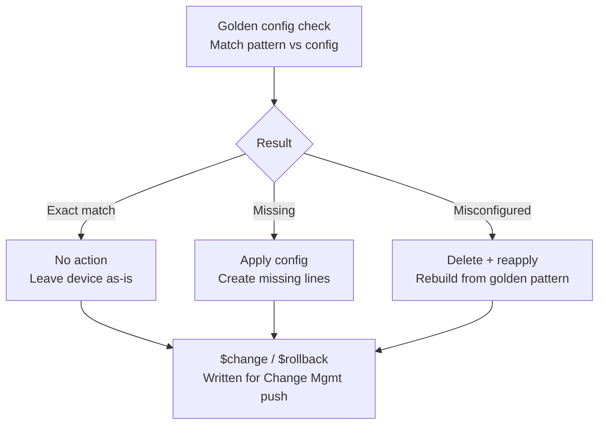

# 🌐 Network Automation & NetBrain Automation Toolkit


---

## 👋 About this repo

I'm a network/IT infrastructure engineer who's spent years building and running network automation for large, global organizations — data centers, campus networks, WAN, security infra, you name it. This repo is a **living library of the automations I've actually deployed in the field**: scripts and workflows that replaced manual, error-prone, repetitive work with something reliable, auditable, and fast.

Every automation here started as a **real problem on a real network** — not a toy example. The goal of this library: capturing tools and flows that have already proven their value, measured in hours saved, incidents avoided, and budget reclaimed.

This repo mixes two things:
- **Python scripts** — standalone, portable, run anywhere (Netmiko/NAPALM/Nornir-based).
- **NetBrain Intents** — visual, diagnosis-driven automations built natively inside the [NetBrain](https://www.netbraintech.com/) platform, which I use heavily in production engagements for compliance, self-healing remediation, and dashboarding.

> *Numbers below are real. Customer names, specific environments, and internal project details have been generalized for confidentiality.*

---

## 💡 Why this exists

Network teams everywhere fight the same battles:
- Config drift nobody notices until an outage
- Manual changes across hundreds of devices, done by hand, at 2am
- Audits and compliance checks that eat entire sprints
- Tribal knowledge that walks out the door when someone leaves

Every automation in this repo was built to kill one of these problems — with a *measurable* before/after.

---

## 🧰 Two ways I build automation

| | Python scripts | NetBrain Intents |
|---|---|---|
| **Where it runs** | Anywhere — cron, CI/CD, your laptop | Inside the NetBrain platform, against its live CMDB |
| **Best for** | Bespoke multi-vendor scripting, one-off tooling, anything outside a NetBrain deployment | Diagnosis-driven checks, self-healing remediation, dashboards tied to the network's real-time map |
| **Output** | `.py` files you can run directly | Documented as flow diagrams + pseudocode/exported logic, since the native format is a visual workflow, not raw text |

Same philosophy either way: **diagnose precisely, remediate safely, always leave a rollback path.**

---

## 📂 Repository structure

```
network-automation-toolkit/
├── python-scripts/
│   ├── config-backup/            # Automated multi-vendor config backup & versioning
│   ├── config-standards/         # Turn company configuration standards into cookie-cutter tools
│   ├── compliance-audit/         # Security/config compliance checks against baselines
│   ├── bulk-config-deployment/   # Mass config pushes with pre/post validation
│   ├── network-discovery/        # Auto-inventory & topology mapping
│   ├── auto-remediation/         # Self-healing / auto-remediation scripts
│   ├── reporting-dashboards/     # Capacity, health & change reporting
│   └── shared/                   # Common helpers (connection handling, logging, inventory parsing)
├── netbrain-intents/
│   ├── golden-config-remediation/    # Generic match → remediate → rollback pattern (see diagram below)
│   ├── ntp-access-list-remediation/  # Flagship Intent: diagnose + self-heal NTP peer ACLs
│   ├── cis-benchmark-dashboards/     # Multi-vendor CIS compliance scoring + auto-refreshing dashboards
│   └── README.md                     # How each exported Intent flow is documented
└── requirements.txt
```

Each folder has its own `README.md` with setup instructions (Python) or a flow write-up (NetBrain Intents), plus sample output.

---

## 🔁 The golden-config self-remediation pattern

A pattern I reuse across most compliance checks (ACLs, NTP, DHCP helper, NetFlow, VTY lines, etc.) — match against a golden baseline, then branch into exactly the corrective action needed, with a rollback always built alongside the change:



This is the backbone of the NTP Intent below, and of most of the "Config Compliance" use cases in the table further down.

---

## ⭐ Flagship example: NTP access-list self-remediation (NetBrain Intent)

**Problem:** NTP peer access-groups drift — missing entirely on some devices, partially misconfigured on others — and nobody notices until time sync issues start causing certificate or logging headaches.

**How it works:**
1. **Diagnose** — check whether the NTP peer access-group exists and matches the golden pattern.
2. **Already correct** → log a healthy status, no action taken.
3. **Missing entirely** → generate the `change` command (apply the ACL) and a matching `rollback` command (remove it) in one pass.
4. **Present but wrong** → diff the live ACL against the expected pattern line-by-line: unmatched lines get flagged for removal, missing expected lines get flagged for addition — each with its own rollback counterpart.
5. Once a change payload exists, it's pushed through the standard **Change Management** template on the device (apply → save → brief pause → validate).

**Impact:** turns a "someone eventually notices NTP is broken" problem into a nightly self-healing check with a built-in undo path — no manual ACL surgery required.

---

## 📊 CIS benchmark compliance, self-updating dashboards

Beyond one-off checks, I run continuous **CIS benchmark compliance scoring across multiple vendors** (Cisco, Palo Alto, Fortinet, and others), feeding dashboards that regenerate automatically as new scan data comes in — so leadership always sees current-state posture without anyone manually rebuilding a report.

---

## 🚀 Featured use cases (field-tested, real impact)

### Config Compliance
| Automation | What it does | Typical impact |
|---|---|---|
| WiFi AP – switchport config | Correlates CDP neighbor detail against expected AP switchport config, flags non-compliant ports | ~90% time reduction vs. manual audit |
| Flexible assessment / remediation | On-demand search for any arbitrary config line across the whole fleet, with a generated remediation plan | No prior tooling equivalent |
| DHCP (ip-helper) config | Verifies correct IP-helper config on every L3 interface for proper DHCP failover | ~90% time reduction |
| NTP with FQDN standardization | Rolls out a single FQDN-based NTP standard fleet-wide | ~98% time reduction |
| NetFlow config standardization | Strips stale config, standardizes NetFlow — also cuts licensing costs from duplicate device entries | ~87% time reduction |
| Startup vs. running config mismatch | Flags devices where "write memory" was forgotten by comparing config timestamps | Weekly automatic check |

### Security Audits
| Automation | What it does | Typical impact |
|---|---|---|
| VTY line hardening (Telnet → SSH) | Detects Telnet-enabled VTY lines, generates SSH-only remediation | ~92% time reduction |
| Public IP address reporting | Builds an exportable report of every public IP bound to an interface, fleet-wide | ~99% time reduction |
| Internet edge ACL hardening | Finds internet-facing interfaces missing an ACL | ~98% time reduction |
| HTTP server detection & remediation | Flags devices with an HTTP server enabled, proposes remediation | Quarterly audit requirement |

### Routing & Switching Health
| Automation | What it does | Typical impact |
|---|---|---|
| BGP / OSPF neighbor state-change detection | Daily detection of routing adjacency flaps | Visibility not available in off-the-shelf monitoring |
| BYOD VRF standardization & reachability | Confirms guest/BYOD VRF routing (default route + expected subnets) is standardized and reachable | ~90% time reduction |
| BYOD VLAN standardization | Ensures the guest VLAN config is consistent across campus/office switches | ~89% time reduction |
| EtherChannel inactive member detection | Flags inactive members inside switch port-channels | ~89% time reduction |
| Switch-to-switch trunk standardization | Confirms neighboring switches are trunking correctly to each other | ~89% time reduction |
| Allowed-VLANs standardization | Standardizes allowed VLANs on trunks between neighbors | On-demand check |
| STP mode & root bridge detection | Detects spanning-tree mode and root bridge placement | No prior alternative in existing toolset |

### Device Health & Troubleshooting
| Automation | What it does | Typical impact |
|---|---|---|
| Device uptime & reload-reason reporting | Daily report + alert on devices with recent/short uptime | Early warning for flapping hardware |
| Bulk CLI retrieval | Pulls arbitrary CLI output from any number of devices on demand | Major accelerator for TAC case resolution and troubleshooting |

---

## 🛠 Tech stack

- **Python 3.9+**
- [Netmiko](https://github.com/ktbyers/netmiko) / [NAPALM](https://github.com/napalm-automation/napalm) — multi-vendor device connectivity
- [Nornir](https://github.com/nornir-automation/nornir) — automation framework & inventory
- [Paramiko](https://github.com/paramiko/paramiko) — SSH under the hood
- Jinja2 — config templating
- **NetBrain** — CMDB-driven map, Intent (diagnosis + remediation) engine, and Change Management module for the visual-workflow automations

---

## ⚡ Getting started

```bash
git clone https://github.com/<your-username>/network-automation-toolkit.git
cd network-automation-toolkit
pip install -r requirements.txt
```

- **Python scripts:** each folder has a sample `inventory.yaml` — replace with your own devices, and use `--dry-run` where destructive actions are possible.
- **NetBrain Intents:** you'll need a NetBrain instance to run these natively, but every flow is documented with diagrams and logic write-ups so the *pattern* is portable into your own tooling (Python, Ansible, whatever you run) even without NetBrain.

⚠️ **Always test in a lab or with `--dry-run`/a non-prod Intent before running against production networks.**

---

## 🤝 Contributing

This library grows with real-world input. If you've got a network automation script — or an Intent-style workflow from another platform — that's saved you real time or prevented real pain:

1. Fork the repo
2. Add it under the relevant folder (or a new one)
3. Include a short README explaining the problem it solves and the impact it had
4. Open a PR

Bug reports, vendor-support additions, and improvements to existing automations are all welcome too.

---

## 📜 License

This project is licensed under the **MIT License** — see [LICENSE](LICENSE) for details. Use it, fork it, adapt it for your network, commercially or otherwise.

---

## 📬 Connect

If this toolkit saved you time or you want to swap notes on network automation in the field, feel free to open an issue or connect with me on [LinkedIn](#).

*Built by network engineers, for network engineers.*
