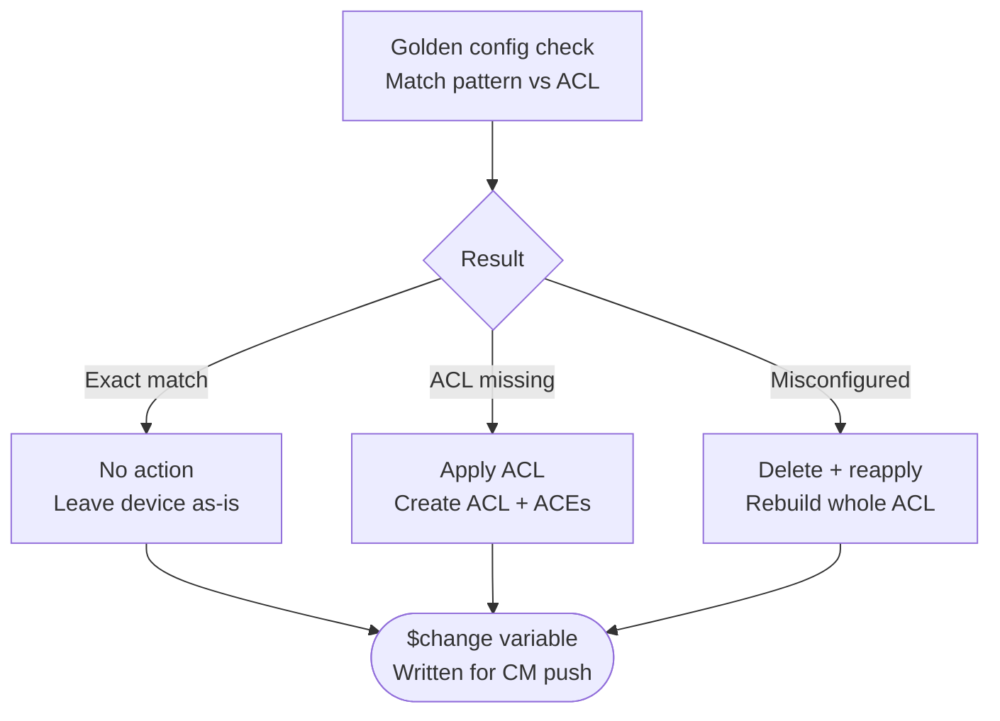

# 🕸️ Network Automation Toolkit


---

## 🗝️ About this repo

I'm a network and IT infrastructure engineer. I've spent years building automation for large global companies: data centers, campus networks, WAN, security infrastructure, pretty much all of it. This repo is where I collect the automations I've actually built and used on real networks. Not toy examples or demos, just stuff that replaced manual work, cut down on errors, and saved real time.

It's a mix of two things. Some of it is plain Python scripts you can run anywhere. The rest is built as Intents inside NetBrain, the platform I use day to day for diagnosis and remediation work.

One note: the numbers below are real, but I stripped out anything that could point to a specific customer or project.

---

## 🗄️ Repository structure

```
network-automation-toolkit/
├── config-backup/             # Multi-vendor config backup and versioning
├── config-standards/          # Company config standards turned into reusable checks
├── compliance-audit/          # Config and security checks against a baseline
├── bulk-config-deployment/    # Pushing config changes at scale, with validation
├── network-discovery/         # Auto inventory and topology mapping
├── auto-remediation/          # Scripts and flows that fix things automatically
├── golden-config-remediation/ # The match/fix/rollback pattern explained below
├── cis-benchmark-dashboards/  # Multi-vendor CIS scoring, dashboards that update on their own
├── reporting-dashboards/      # Capacity, health, and change reporting
├── shared/                    # Common helpers used across the scripts
└── requirements.txt
```

---

## ⚗️ How we tackle config compliance

Most of the compliance checks in here work the same way. Check the device against a golden baseline, figure out exactly what's wrong, and fix only that. Every fix comes with a rollback built in, so nothing gets pushed without a way back out. Here's the pattern, using our NTP access list check as the example:



Same idea shows up again and again below: VTY lines, DHCP helper, NetFlow, NTP, you name it.

---

## 📊 CIS benchmark dashboards

We run CIS benchmark checks across multiple vendors (Cisco, Palo Alto, Fortinet, and others) on a schedule, and the dashboards update themselves as new data comes in. Nobody has to rebuild a report by hand.

---

## ⚔️ Use cases (real stuff, real results)

### Config Compliance
| Automation | What it does | Typical impact |
|---|---|---|
| WiFi AP Switchport Compliance | Correlates CDP neighbor data against expected AP switchport config | ~90% time reduction vs. manual audit |
| Flexible Config Assessment | Searches for any arbitrary config line across the fleet and proposes remediation | No prior tooling equivalent |
| DHCP Helper Compliance | Verifies correct IP-helper config on every L3 interface | ~90% time reduction |
| NTP FQDN Standardization | Rolls out a single FQDN-based NTP standard fleet-wide | ~98% time reduction |
| NetFlow Config Standardization | Strips stale config and standardizes NetFlow fleet-wide | ~87% time reduction |
| Startup/Running Config Mismatch | Flags devices where a config save was likely forgotten | Weekly automatic check |

### Security Audits
| Automation | What it does | Typical impact |
|---|---|---|
| VTY Line Hardening | Detects Telnet-enabled VTY lines and remediates to SSH-only | ~92% time reduction |
| Public IP Address Report | Builds an exportable report of every public IP on the network | ~99% time reduction |
| Internet Edge ACL Hardening | Finds internet-facing interfaces missing an ACL | ~98% time reduction |
| HTTP Server Detection | Flags devices with an HTTP server enabled and proposes remediation | Quarterly audit requirement |

### Routing & Switching Health
| Automation | What it does | Typical impact |
|---|---|---|
| BGP/OSPF Flap Detection | Detects routing adjacency flaps daily | Visibility not available off the shelf |
| BYOD VRF Standardization | Confirms guest VRF routing and reachability is standardized | ~90% time reduction |
| BYOD VLAN Standardization | Ensures guest VLAN config is consistent fleet-wide | ~89% time reduction |
| EtherChannel Inactive Members | Flags inactive members inside port-channels | ~89% time reduction |
| Switch-to-Switch Trunk Standardization | Confirms neighboring switches trunk correctly to each other | ~89% time reduction |
| Trunk Allowed-VLANs Standardization | Standardizes allowed VLANs on trunks between neighbors | On-demand check |
| STP Mode & Root Bridge Detection | Detects spanning-tree mode and root bridge placement | No prior alternative in existing toolset |

### Device Health & Troubleshooting
| Automation | What it does | Typical impact |
|---|---|---|
| Device Uptime Report | Reports and alerts on devices with short/recent uptime | Early warning for flapping hardware |
| Bulk CLI Retrieval | Pulls arbitrary CLI output from any number of devices on demand | Major accelerator for TAC case resolution |

---

## 🧬 Tech stack

Python 3.9+, Netmiko, NAPALM, Nornir, and Jinja2 for the scripts. NetBrain for the CMDB, Intent engine, and Change Management side of things.

---

## ⛏️ Getting started

```bash
git clone https://github.com/<your-username>/network-automation-toolkit.git
cd network-automation-toolkit
pip install -r requirements.txt
```

The Python scripts come with a sample inventory.yaml. Swap in your own devices and use `--dry-run` where it's available. Running the NetBrain Intents needs a NetBrain instance, but each one is written up well enough that you can rebuild the same logic in whatever tool you use.

⚠️ **Test in a lab first, or use dry-run, before you touch production.**

---

## 🩹 Contributing

Got a script that's saved you real time? Fork it, drop it in the right folder with a quick note on what problem it solves, and open a PR.

---

## 📜 License

MIT, see [LICENSE](LICENSE). Use it, fork it, change it, sell it if you want.

---

## 🦇 Connect

Open an issue or find me on [LinkedIn](#) if you want to compare notes.
